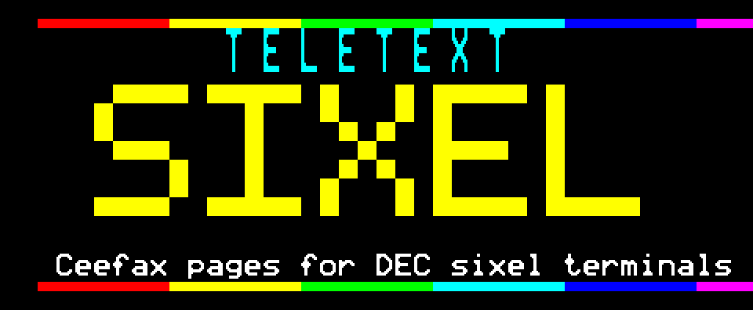

<p align="center"></p>

# teletext-sixel

Teletext pages for DEC sixel terminals. Write Ceefax-style pages by
hand or build them from RSS feeds, then send them to a VT340 (or any
terminal that understands sixel) as graphics, or as text using a
downloaded soft font.

The pages I run are published hourly to an FTP server, and a PDP-11
running RSX-11M-PLUS fetches them and shows them on its VT340.

Python 3, standard library only. Pillow is used if it is installed, but
only for image formats other than PNG and Netpbm.

## Quick start

```sh
./ttx demo                          # the demo page, as sixel, to stdout
./ttx view                          # page through the bundled pages
./ttx view pages/feeds --delay 8    # cycle through a directory of pages
./ttx preview teletext/demo.ttx     # ANSI preview for terminals without sixel
./ttx render teletext/demo.ttx --png demo.png
./ttx edit pages/mypage.ttx         # full-screen editor
./ttx selftest                      # run the tests
```

Build a page service from feeds and look at it:

```sh
./ttx feeds build news sport weather slashdot --front --limit 6
./ttx view pages/feeds
```

## Viewing pages in a terminal

`./ttx view` draws a page and waits for a key:

```
space / n   next page          r   reveal concealed text
p / b       previous page      f   toggle flash
d           cycle colour depth q   quit
```

`--delay N` advances automatically.

xterm needs to be told to emulate a VT340 before it will draw sixel:

```sh
xterm -ti vt340 -tn xterm-256color
```

or in `~/.Xresources`:

```
XTerm*decTerminalID: 340
XTerm*numColorRegisters: 256
```

mlterm, foot, WezTerm, Contour and recent kitty work without any
settings. Before drawing, `view` checks that the terminal supports sixel
and asks how many colour registers it has. `--no-probe` skips this.

### Colour depth

Registers 0–7 hold the eight teletext colours and photographs use the
rest. Drawing with more registers than the terminal has corrupts the
picture, so if the terminal doesn't answer, `view` assumes 16, the same
as a VT340.

| `--depth` | registers | photo colours | use for |
|---|---|---|---|
| `auto` (default) | as reported | up to 64 | |
| `low` | 16 | 8 | a VT340, or xterm with default settings |
| `medium` | 64 | 56 | |
| `high` | 256 | 64 | a modern terminal with more registers configured |
| a number | that many | | |

`--colour-registers N` overrides the depth. More colours means more
bytes. For one sport page:

| | bytes | at 9600 baud |
|---|---|---|
| `--depth low` | 31006 | 32 s |
| `--depth medium` | 46759 | 49 s |
| `--depth high` | 49519 | 52 s |

## Page format (`.ttx`)

A page is 40 columns by 25 rows of 7-bit codes. Each line of the file is
one row. A `#` in column 1 starts a comment and `!` starts a directive.
Anything in `{braces}` is a control code, and like on a real page it
takes up a character cell.

```
!title TELETEXT DEMO
!page 100
{cyan}P100 {white}TELETEXT DEMONSTRATION{yellow}   VT340
{gred}███████████████████████████████████████
{yellow}{double}TELETEXT SIXEL
```

| Token | Meaning |
|---|---|
| `{black} {red} {green} {yellow} {blue} {magenta} {cyan} {white}` | text colour |
| `{gblack} {gred} … {gwhite}` | mosaic (graphics) colour |
| `{k} {r} {g} {y} {b} {m} {c} {w}`, `{gr}`, `{gy}` … | short forms |
| `{double}` `{normal}` | double / normal height |
| `{flash}` `{steady}` | flashing text |
| `{conceal}` | hidden until revealed |
| `{contig}` `{sep}` | contiguous / separated mosaics |
| `{newbg}` `{bgblack}` | background to the current colour / to black |
| `{hold}` `{release}` | hold mosaics |
| `{box}` `{endbox}` | boxing |
| `{7F}` | any code, in hex |
| `{##.#..}` | one mosaic cell, six blocks in reading order |
| `{{` | a literal `{` |

| Directive | Meaning |
|---|---|
| `!title TEXT` | page title |
| `!page N` | page number |
| `!charset english\|ascii` | character set (English has `£ ← ½ → ↑ # — ¼ ‖ ¾ ÷`) |
| `!row N [text]` | move to row N |
| `!meta key = value` | metadata; `image`, `imagebox` and `link` are used |
| `!graphic row=R col=C colour=NAME sep=0` … `!endgraphic` | pixel art |

In a `!graphic` block each line is a row of pixels drawn with `#` and
`.`, at two pixels across and three down per character cell. The colour
code goes in the cell to the left of the art.

A row longer than 40 cells is truncated, with a warning that gives the
row number. `.tti` files (the MRG / edit.tf format) can be loaded and
saved as well.

## Editor

`./ttx edit page.ttx` opens the page in a curses editor. Control codes
are shown as reverse-video letters and mosaics as Unicode sextants.

```
arrows/Home/End/Tab  move          F1  help          F2  save
ESC then r g y b …   text colour   F3  sixel preview F4  text dump
ESC then R G Y B …   mosaic colour F5  pixel mode    F10 quit
ESC then d n f s p o h e v z x     other attributes
pixel mode: Q W / A S / Z X toggle the six blocks, space clears
^Y delete row   ^U insert row   ^D duplicate row
```

## Rendering

Pages are drawn directly at the terminal's pixel size, with no scaling.
`--scale` sets the size of a character cell:

| `--scale` | cell | page |
|---|---|---|
| 1 | 6×9 | 240×225 |
| 1.5 (default) | 9×14 | 360×350 |
| 2 | 12×18 | 480×450 |

All three sizes fit on a VT340's 800×480 screen. Each character is built
from its 5×9 shape. At 9×14 the columns that hold vertical stems are two
pixels wide, so stems all come out the same weight. Where the cell is
large enough, diagonals are cut along the outline used by the
[Bedstead](https://bjh21.me.uk/bedstead/) font, so bigger cells get
smooth 45° edges rather than bigger steps. At 12×18 the output is the
SAA5050 teletext chip's own double-size character.

```
--scale N            1, 1.5, 2 …          --sx / --sy for separate axes
--terminal NAME      vt125 vt240 vt241 vt330 vt340 xterm
--mono --ink green   one ink colour, for a VT125 or VT240
--transparent        don't paint the background
--clear --home       clear the screen / home the cursor first
--reveal             show concealed text
--flash-off          draw flashing text as blank
--no-rounding        don't fill in diagonal steps
--png FILE           write a PNG instead of sixel
```

`--terminal` limits the output to that terminal's colour registers. On a
VT240, for example, colours are mapped to the nearest of its four. You
also get a warning if the page is too big for the terminal's screen.

The encoder paints each band's most common colour as one run and draws
the other colours over it. That makes `--transparent` slightly *larger*
than a normal page, so use it for overlaying a page on the screen, not
to save bytes. To send less data, use `--scale 1` or `--mono`.

## Sending pages as text

VT220 and later terminals accept a downloadable character set (DECDLD).
Once the teletext font is loaded, a page can be sent as 40×25 characters
instead of an image:

```sh
./ttx softfont --device /dev/ttyS0 --baud 9600      # once per session
./ttx render pages/feeds/101.ttx --emit text --device /dev/ttyS0
```

| | bytes | at 9600 baud |
|---|---|---|
| soft font, both sets | 8406 | 8.8 s, once |
| news index as text | 1629 | 1.7 s |
| news index as sixel | 7713 | 8.0 s |
| weather table as text | 1949 | 2.0 s |
| weather table as sixel | 9763 | 10.2 s |

| teletext | terminal |
|---|---|
| 40 columns | `DECDWL` double-width lines |
| double height | `DECDHL` |
| text characters | a 94-character soft set in G0 |
| mosaics | a 96-character soft set in G1, selected with SO/SI |
| colour, flash, conceal | `SGR` 30–37, 40–47, 5, 8 |

`--cell WxH` sets the cell size the font is built for (10x20 for a
VT340). `--text-rows` sets how many of the 25 rows are sent. The default
is 24, which leaves out the navigation row. Text mode can't show
photographs, so build pages with `--images mosaic` to get teletext block
graphics the page itself holds, or use sixel for those pages.

`ttx publish --emit text` writes the whole service this way, with the
font beside the pages as `<prefix>FNT.DAT` (`--no-font` leaves it out).
A viewer sends the font once a session and each page after that is a
couple of kilobytes:

| | sixel | text, photos as mosaics |
|---|---|---|
| news story with a photograph | 24281 bytes, 25 s | 1563 bytes, 1.6 s |
| weather map | 10205 bytes, 10.6 s | 1611 bytes, 1.7 s |
| whole 35-page service | 490 KB | 58 KB, plus the font once |

Set `TTX_EMIT=text` and `TTX_IMAGES=mosaic` for the deploy and refresh
scripts to publish the service that way.

The font data is checked by decoding it again
(`tests/decdld_decode.py`), but it hasn't been tried on a real VT340
yet. If it looks wrong, try changing the cell size and the `Pt`
parameter first.

## Serial output

```sh
./ttx render pages/feeds/101.ttx --device /dev/ttyS0 --baud 9600
./ttx render pages/feeds/*.ttx --loop --delay 10 --device /dev/ttyS0 --baud 9600
scripts/ceefax-service.sh /dev/ttyS0 9600
```

`--device` sets the line speed with `stty`. For a terminal without
working flow control, `--throttle MS` and `--chunk BYTES` slow the
output down.

## Feeds

```sh
./ttx feeds list
./ttx feeds build news sport --front --limit 6
./ttx feeds build https://lwn.net/headlines/rss --title LWN --base 420
./ttx feeds carousel news sport --delay 12 --refresh 900 \
    --device /dev/ttyS0 --baud 9600
```

`build` writes one `.ttx` file per page into `pages/feeds`: an index at
the feed's base page number, then one page per story. `--front` adds a
front page at 100. `carousel` builds the pages, sends them in rotation
and rebuilds every `--refresh` seconds.

| feed | page | feed | page |
|---|---|---|---|
| news | 101 | sport | 300 |
| uk | 110 | football | 310 |
| world | 120 | cricket | 320 |
| politics | 130 | weather | 400 |
| business | 140 | register | 400 |
| tech | 150 | slashdot | 410 |
| science | 160 | lwn | 420 |
| health | 170 | | |
| entertainment | 180 | | |

A story page uses the text of the linked article when the feed only has
a short summary. `--no-full-text` turns that off, `--body-paragraphs N`
sets how many paragraphs are kept (0 for all) and `--article-chars N`
limits the length.

Downloads are cached in `~/.cache/ttx` (or `$TTX_CACHE`) for
`--max-age` seconds. If the network is down, the cached copy is used.
`--refresh-now` ignores the cache, and `--from-file` builds from a saved
XML file.

Headers show the date. `--clock` adds the time.

### Weather

```sh
./ttx feeds build weather
./ttx feeds build weather --places London,Edinburgh,Cardiff
```

Weather pages come from the BBC's three-day forecast for each location:

- **400**: a map of the UK with the temperature for each place, and a
  list of all of them down the side
- **401**: today, for every location
- **402**: tomorrow
- **403 onwards**: three days for one place, with wind, humidity and a
  weather symbol

Locations are GeoNames ids, listed in `weather.LOCATIONS`.

### Pictures

`--images` controls what happens to a story's photo:

- `sixel` (default): the photo is drawn into the page using the spare
  colour registers. On a VT340 that's 8 colours; a modern terminal
  gets up to 64.
- `mosaic`: the photo is converted to teletext block graphics and
  stored in the `.ttx` file. About half the size, but only simple
  pictures come out recognisable.
- `none`: text only.

On one news page at `--scale 2`:

| | bytes | at 9600 baud |
|---|---|---|
| `--images mosaic` | 9695 | 10 s |
| `--images sixel`, VT340 | 26891 | 28 s |
| `--images sixel --transparent`, VT340 | 23952 | 25 s |
| `--images sixel`, xterm, 64 colours | 65265 | 68 s |

Slashdot's feed has no story images, only the site logo and share
buttons, which are ignored, so the Slashdot pages are text only.

Converting to mosaics works like this:

1. The brightness is equalised (`--equalise`, 0 to turn off), so dark
   and bright photos both get a sensible mix of lit and unlit blocks.
2. Each cell is dithered between its ink and the black background
   (`--dither-strength`, default 0.35).
3. One ink colour is chosen per cell, preferring the colour already in
   use, because every colour change uses up a cell.
4. Hold mosaics fill the cells taken by colour changes (`--no-hold` to
   turn off).

For sixel, the photo is reduced to the available colours with median
cut and Floyd–Steinberg dithering.

`./ttx image` converts a single image:

```sh
./ttx image photo.jpg --mode colour -o page.ttx
./ttx image photo.jpg --mode mono --ink cyan -o page.ttx
./ttx image photo.jpg --as sixel --width 640 --colours 16
```

## Publishing to the PDP-11

The pages are sent to the PDP-11 as files. They're published to an FTP
server, and the PDP-11 downloads them and types them to the VT340. The
RSX side is described in [`pdp11/README.md`](pdp11/README.md).

```
scripts/refresh.sh     build pages/feeds from the feeds, then run deploy.sh
scripts/deploy.sh      render pages/feeds to .publish/S<n>.DAT and upload them
PDP-11 TTXFET          download S*.DAT at five past each hour
PDP-11 TTXVW           show the pages (a BASIC-PLUS-2 program)
```

### File locations

| location | contents |
|---|---|
| `pages/feeds/` | built `.ttx` pages |
| `.publish/` | `.DAT` files from the last deploy |
| `.publish.log` | output from cron |
| `scripts/deploy.conf` | the FTP server's SSH login (local only, not in the repository) |
| FTP server: `/var/ftp/public/sixel/` | live pages, the page list and the soft font, uploaded over SSH |
| anonymous FTP: `sixel/` | the same directory, as the PDP-11 sees it |
| PDP-11: `DB0:[203,1]` | downloaded pages and the viewer |

A separate text-only teletext service uses the same FTP server. It keeps
its `P<n>.DAT` files in `/var/ftp/public/` and on the PDP-11 in
`DB0:[201,1]`. This service uses its own directory and an `S` prefix so
the two never overwrite each other.

### Deploying

```sh
scripts/deploy.sh             # render, upload, remove old pages
scripts/deploy.sh --dry-run   # render, then list the pages that would be removed
scripts/refresh.sh            # rebuild from the feeds, then deploy
```

`deploy.sh` renders every page in `pages/feeds` with `ttx publish`
(`--scale 1.5 --depth low --clear --record 132 --emit "$TTX_EMIT"`),
alongside `SIDX.DAT`, the page list a viewer reads instead of knowing
the numbers, and uploads the files
to `.incoming/` inside the FTP directory. Then it deletes any live
`S*.DAT` that isn't in the new set and moves the new files into place.
Pages for stories that have left the feed are removed, and the PDP-11
never downloads a half-finished upload.

`--record 132` splits each page into lines of at most 132 characters.
RSX files are record-based, and RSX wraps terminal output at 173
characters. A wrap in the middle of a sixel run-length token would break
the picture, so lines are only split between tokens.

Settings are read from the environment or from `scripts/deploy.conf`.
The environment wins.

| variable | default | |
|---|---|---|
| `TTX_HOST` | none, required | `user@host` for SSH to the FTP server |
| `TTX_REMOTE` | `/var/ftp/public/sixel` | FTP directory |
| `TTX_PAGES` | `pages/feeds` | pages to publish |
| `TTX_EMIT` | `sixel` | `text` publishes pages as characters in the soft font, 4-15x smaller |
| `TTX_IMAGES` | `sixel` | `mosaic` draws photos as teletext blocks, which text mode can show |
| `TTX_PREFIX` | `S` | file name prefix |
| `TTX_SERVICES` | `news science sport weather slashdot` | feeds built by `refresh.sh` |

```sh
# scripts/deploy.conf
: "${TTX_HOST:=user@ftp-server}"
```

SSH runs in batch mode, so the FTP server needs key authentication set
up for that user.

The FTP server has to be reachable from the machine that runs the
script. If it isn't, `deploy.sh` still writes `.publish/`, then stops
with `Connection timed out` or `scp: Connection closed` and leaves the
server unchanged. A successful run ends with a
`deployed N pages to …` line. In that case, copy the files in
`.publish/` to the FTP directory from a machine that can reach it.

Crontab entry:

```
0 * * * * /home/richard/Source/teletext-sixel/scripts/refresh.sh >> /home/richard/Source/teletext-sixel/.publish.log 2>&1
```

### Deploying locally

If the FTP directory is on the same machine, `deploy.sh`'s SSH round
trip is unnecessary. `deploy-local.sh` and `refresh-local.sh` do the
same job by copying files into place directly:

```sh
scripts/deploy-local.sh             # render, copy into place, remove old pages
scripts/deploy-local.sh --dry-run   # render, then list the pages that would be removed
scripts/refresh-local.sh            # rebuild from the feeds, then deploy
```

Same `TTX_REMOTE` / `TTX_PAGES` / `TTX_PREFIX` variables as above, but
no `TTX_HOST` and no `deploy.conf` - the copy is local so there's no
login to configure. This is what actually runs on this box:

```
0 * * * * /home/richard/teletext-sixel/scripts/refresh-local.sh >> /home/richard/teletext-sixel/.publish.log 2>&1
```

`refresh-local.sh` builds `register` separately from the other
services, since it shares its default base page (400) with weather.
`scripts/front_page.py` then stitches the front page together from
both builds' summaries, since `ttx feeds build --front` only covers
services built in the same call.

### Published pages

| page | contents |
|---|---|
| 100 | front page |
| 101–109 | BBC News index and stories |
| 160–164 | BBC Science |
| 199, 200 … | directory of all published pages |
| 300–306 | BBC Sport |
| 400–408 | weather |
| 410–418 | Slashdot |
| `SNF.DAT` | "page not found" |
| `SIDX.DAT` | page list, one `number title` line per page, for viewers |
| `SFNT.DAT` | the soft font, when the service is published as text |

Over 43 pages, with a VT340's 16 colour registers:

| | median bytes | at 9600 baud |
|---|---|---|
| `--scale 1.5` | 11501 | 12 s |
| `--scale 1` | 6994 | 7 s |

Index and weather pages take 5–10 seconds at 9600 baud. Story pages
with a photo take 16–25 seconds.

## Logo

The logo at the top of this file is a teletext page, `docs/logo.ttx`.
`./ttx render docs/logo.ttx` shows it on a sixel terminal, and
`scripts/logo.py` regenerates `docs/logo.svg` from it.

## Source layout

```
ttx                       command-line entry point
teletext/font.py          5x9 character shapes, drawn at any cell size
teletext/page.py          page model, .ttx and .tti files
teletext/render.py        teletext attributes -> bitmap
teletext/sixel.py         sixel encoder, terminal profiles, line wrapping
teletext/decdld.py        soft font and text-mode output
teletext/imageconv.py     image decoding, mosaic conversion, quantising, PNG output
teletext/editor.py        curses editor
teletext/cli.py           commands
teletext/demo.ttx         demo page
teletext/feeds/           feed download and parsing, article text, page builder,
                          weather pages and map
scripts/refresh.sh        rebuild and deploy over SSH (run from cron)
scripts/deploy.sh         publish pages to a remote FTP server
scripts/refresh-local.sh  rebuild and deploy locally (run from cron)
scripts/deploy-local.sh   publish pages to a local FTP directory
scripts/front_page.py     stitch the front page together when register
                          and weather are built separately
scripts/ceefax-service.sh page carousel on a serial line
scripts/logo.py           rebuild docs/logo.svg
pdp11/TTXBV.B2S           the viewer, in BASIC-PLUS-2
pdp11/TTXVW.CMD           starts the viewer and downloads the pages
pdp11/                    the older Indirect viewer, fetch job and FTP script
docs/                     logo
pages/                    pages (pages/feeds is generated)
tests/                    unit tests, sixel and DECDLD decoders
```

## Notes

Level 1 attributes follow the specification. Colour, flash, height,
contiguous/separated and release take effect from the next cell.
Conceal, background colour and hold take effect in the cell itself.
Held mosaics repeat through control-code cells, and a double-height row
hides the row below it.

The character shapes are the SAA5050's, taken from Ben Harris and Simon
Tatham's [Bedstead](https://bjh21.me.uk/bedstead/), which was checked
against a real chip and is dedicated to the public domain (CC0).

The tests decode the sixel output and compare it pixel by pixel with
the original bitmap.
